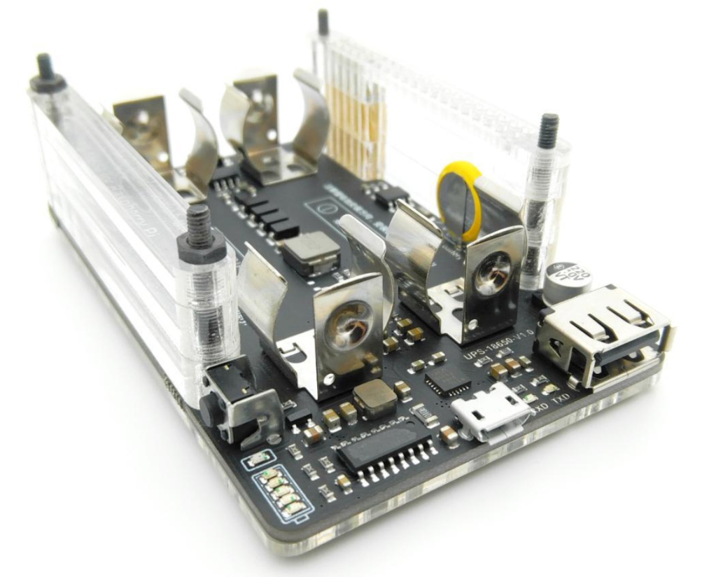

# pi-battery-widget

This code has been forked from the pi-battery-widget status icon widget, with major design changes
to support The Red Reactor Raspberry Pi UPS, including accurate battery life modelling for charging
and discharging profiles.

Please visit https://github.com/Scally-H/RedReactor for more technical details and code examples.

Please visit https://www.theredreactor.com for Info, News and Updates on our Kickstarter Launch!

The C code executes the python code to configure and the read the battery voltage and current via
the INA219 I2C device, also allowing for the detection of charging, charging complete and no battery states.

Python code output format is 
```
voltage(float) | current(float) 

4.142 | 1088.98
```

**Features**
- Displays a battery widget on the desktop panel of the general Raspberry LXDE at the right side
in the System Tray section.
- The green bar turns red if the battery charge left is below 10%, and yellow if the
battery is charging.
- The time remaining is displayed as a tooltip (both for charging and discharging!)
- The display is updated every 5 seconds
- Logs all activities in ~/RedReactor_batteryLog.txt
- Log File shows instant and averaged readings, battery life and status
   chargingState = -1 is "no battery"
   chargingState = 0 is "discharging"
   chargingState = 1 is "charging"
   chargingState = 2 is "AC or Externally Powered "  
 
- Actual battery reading code is done in python script based on The Red Reactor configuration


The Red Reactor UPS for Raspberry Pi zero, Pi Model 2/3 and Pi Model 4!



**Installation**

Open a terminal and type the following

```
  cd
  cd Downloads
  git clone https://github.com/Scally-H/pi-battery-widget
  cd pi-battery-widget
```

Make sure GTK3.0 library is installed:
```
sudo apt install libgtk-3-dev
```


Compile the code with the following commands:
```
  make
```

Finally install the widget with the following commands:
```
  chmod +x install
  ./install 
```

Please check the install script output for errors. It has been tested on Raspberry Pi with Buster,
and creates or updates the ~/.config/lxsession/LXDE-pi/autostart file.

Please adjust your chosen battery capacity by editing ~/.config/lxpanel/LXDE-pi/panels/redreactor.conf
(given in mAh for total capacity)

Reboot your pi.


**To update the widget to the latest version**

Open a terminal and type

```
  cd
  cd Downloads/pi-battery-widget
  git pull
  make
```
Now install the updated widget
```
  chmod +x install
  ./install
```


**To uninstall the widget**

Open a terminal and type

```
  cd
  cd Downloads/pi-battery-widget
  chmod +x uninstall
  ./uninstall
```

Please open an issue in this repository or write to hello@theredreactor if you have any feedback
or problem with this repository. Your input is appreciated.


**Reference**

https://wwww.theredreactor.com  
https://github.com/Scally-H/RedReactor  
https://github.com/linshuqin329/UPS-18650  
https://github.com/rricharz/pi-top-battery-widget  

